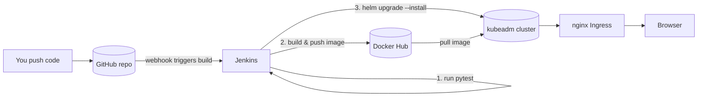

# DevOps CI/CD Demo — Jenkins + Helm + Ingress on kubeadm

A small end-to-end DevOps learning project that shows the full path from
**code → Docker image → Jenkins (CI/CD) → Helm + Ingress** on a self-managed
**kubeadm** cluster (1 master + 1 worker) running on AWS EC2.

Jenkins does **everything**: run tests, build & push the image, then deploy to
the cluster with `helm upgrade`. No ArgoCD.

- Git repo: `https://github.com/Hari230798/Kuberntes-Kubeadm.git`

## Architecture



Jenkins connects to the cluster using a **kubeconfig** stored as a Jenkins
credential, so the `Deploy` stage can run `helm` and `kubectl` directly.

## Project structure

```
.
├── app/                      # Flask application
│   ├── app.py
│   ├── requirements.txt
│   └── tests/test_app.py
├── Dockerfile                # Builds the app image
├── Jenkinsfile               # CI/CD pipeline (test -> build/push -> deploy)
├── helm/myapp/               # Helm chart (Deployment, Service, Ingress)
│   ├── Chart.yaml
│   ├── values.yaml
│   └── templates/
├── .dockerignore
└── .gitignore
```

---

## Prerequisites checklist

- [x] kubeadm cluster: 1 master + 1 worker on EC2 (you have this)
- [ ] A Docker Hub account (free) for the image registry
- [ ] `kubectl` + `helm` available **on the Jenkins machine** (deploy stage needs them)
- [ ] Security groups allow: `6443` (API), `80/443` (ingress), `8080`/`50000` (Jenkins), `30000-32767` (NodePort range)

> Replace the placeholder `your-dockerhub-username/devops-demo` with your real
> Docker Hub repo in [Jenkinsfile](Jenkinsfile) and [helm/myapp/values.yaml](helm/myapp/values.yaml).

---

## Step 1 — Run and test the app locally

```bash
cd app
python3 -m venv venv && . venv/bin/activate
pip install -r requirements.txt
python -m pytest -v          # tests should pass
python app.py                # open http://localhost:5000
```

## Step 2 — Build the Docker image (optional manual test)

```bash
docker build -t your-dockerhub-username/devops-demo:dev .
docker run -p 5000:5000 your-dockerhub-username/devops-demo:dev
curl http://localhost:5000/health
```

## Step 3 — Install an Ingress controller on the cluster

Ingress objects do nothing without a controller. Install nginx (run on the master):

```bash
kubectl apply -f https://raw.githubusercontent.com/kubernetes/ingress-nginx/main/deploy/static/provider/baremetal/deploy.yaml
```

Because you're on kubeadm (not a cloud LoadBalancer), the controller comes up as a **NodePort**. Find the ports:

```bash
kubectl -n ingress-nginx get svc ingress-nginx-controller
# e.g. 80:3XXXX/TCP  443:3YYYY/TCP
```

You reach the app at `http://<EC2-public-ip>:<nodePort>` with the `Host` header
`devops-demo.local`. Either:
- add `<EC2-public-ip> devops-demo.local` to your local `/etc/hosts`, then open `http://devops-demo.local:<nodePort>`, or
- test with curl: `curl -H "Host: devops-demo.local" http://<EC2-public-ip>:<nodePort>/`

## Step 4 — Install Jenkins

Run Jenkins on the master (or a separate EC2). Docker-based quick start:

```bash
docker run -d --name jenkins -p 8080:8080 -p 50000:50000 \
  -v jenkins_home:/var/jenkins_home \
  -v /var/run/docker.sock:/var/run/docker.sock \
  jenkins/jenkins:lts
```

Unlock and install plugins:
1. `docker exec jenkins cat /var/jenkins_home/secrets/initialAdminPassword`
2. Install suggested plugins + **Docker Pipeline**, **Git**, and **Kubernetes CLI**.

### Make `docker`, `kubectl`, and `helm` available inside the Jenkins container

The deploy stage runs these tools. Install them in the Jenkins container (or use
an agent that already has them):

```bash
docker exec -u 0 jenkins bash -c '
  apt-get update &&
  apt-get install -y docker.io curl &&
  curl -L https://dl.k8s.io/release/$(curl -Ls https://dl.k8s.io/release/stable.txt)/bin/linux/amd64/kubectl -o /usr/local/bin/kubectl &&
  chmod +x /usr/local/bin/kubectl &&
  curl https://raw.githubusercontent.com/helm/helm/main/scripts/get-helm-3 | bash
'
```

### Add Jenkins credentials (Manage Jenkins → Credentials → System → Global)

| ID | Kind | What it holds |
|----|------|----------------|
| `dockerhub-creds` | Username with password | Docker Hub username + password/access token |
| `kubeconfig` | Secret file | Your cluster's kubeconfig file (`~/.kube/config` from the master) |

> To get the kubeconfig: on the master run `cat ~/.kube/config`. If the file uses
> a private IP or `127.0.0.1`, change the `server:` line to the master's public IP
> (and make sure `6443` is open) before uploading it as the `kubeconfig` secret.

### Create the pipeline job

1. **New Item → Pipeline**.
2. Under **Pipeline**, choose **Pipeline script from SCM**.
3. SCM: **Git**, Repository URL: `https://github.com/Hari230798/Kuberntes-Kubeadm.git`, branch `main`.
4. Script Path: `Jenkinsfile`. Save.
5. (Optional) Add a GitHub webhook `http://<jenkins-ip>:8080/github-webhook/` so every push triggers a build.

## Step 5 — Push this project to your repo and run the pipeline

```bash
git init
git add .
git commit -m "DevOps CI/CD demo: Jenkins + Helm + Ingress"
git branch -M main
git remote add origin https://github.com/Hari230798/Kuberntes-Kubeadm.git
git push -u origin main
```

Then in Jenkins click **Build Now**. The pipeline stages:

1. **Checkout** — pulls the repo.
2. **Test** — runs pytest.
3. **Build & Push Image** — `docker build`, `docker push` to Docker Hub (tag = build number + `latest`).
4. **Deploy to kubeadm (Helm)** — `helm upgrade --install` using your `kubeconfig`, then waits for rollout.

---

## The full loop, in one sentence

You push code → Jenkins tests, builds `devops-demo:<build#>`, pushes it to Docker
Hub, then runs `helm upgrade --install` on your kubeadm cluster → new pods come up
behind the nginx Ingress.

## Verify a deployment

```bash
kubectl -n devops-demo get pods,svc,ingress
kubectl -n devops-demo rollout status deploy/devops-demo-myapp
curl -H "Host: devops-demo.local" http://<EC2-public-ip>:<ingress-nodePort>/
```

## Common gotchas

- **Ingress returns 404**: check `ingressClassName: nginx` matches the installed controller and the `Host` header matches `values.yaml`.
- **ImagePullBackOff**: the image repo/tag is wrong, or the repo is private (add an `imagePullSecret`).
- **Jenkins can't run docker**: make sure `/var/run/docker.sock` is mounted (as above) and the Jenkins user can access it.
- **Deploy stage fails with "connection refused"**: the kubeconfig `server:` points to a private/localhost address — set it to the master's reachable IP and open port `6443`.
- **`helm: command not found` in the deploy stage**: helm/kubectl aren't installed in the Jenkins container — see the install step above.

## Ideas to extend

- Add a `values-staging.yaml` / `values-prod.yaml` and a parameterized deploy.
- Add an HPA (HorizontalPodAutoscaler) once you have metrics-server.
- Swap Docker Hub for AWS ECR.
- Add TLS with cert-manager + Let's Encrypt on the Ingress.
